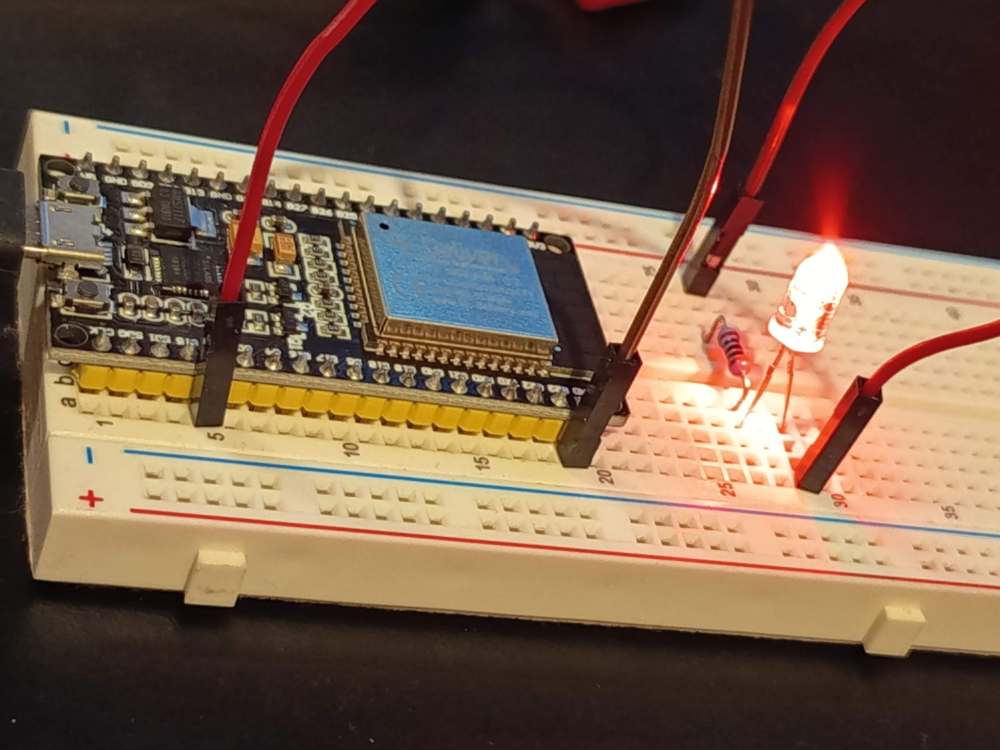

# ESP32 LED-Blink-Test mit IDE unter Ubuntu 24.04

Ein einfaches Einstiegsprojekt für den ESP32: Eine LED wird im Sekundentakt an- und ausgeschaltet. Der Status wird gleichzeitig seriell ausgegeben.



---

## 💡 Beispielsketch

```
int ledPin = 2;

void setup() {
  Serial.begin(115200);
  pinMode(ledPin, OUTPUT);
}

void loop() {
  digitalWrite(ledPin, LOW);   // LED aus
  Serial.println("LED an");
  delay(1000);

  digitalWrite(ledPin, HIGH);  // LED an
  Serial.println("LED aus");
  delay(1000);
}
```
## 🧰 Voraussetzungen
- Ubuntu 24.04  
- ESP32 DevKit (z. B. AZDelivery ESP32-WROOM-32 Modul)  
- USB-Kabel (mit Datenleitungen, nicht nur Ladefunktion)  
- mit Arduino IDE 2.3.6 durchgeführt  

## 🛠️ Arduino IDE 2.x unter Ubuntu 24.04 installieren
1. Snap-Version vermeiden (optional, aber empfohlen)
```
sudo snap remove arduino
# oder
sudo apt purge arduino
```
2. Offizielle IDE herunterladen und manuell installieren
- Gehe auf: https://www.arduino.cc/en/software
- Lade die „Linux 64-bit“-Version herunter (z. B. arduino-ide_2.3.6_Linux_64bit.tar.xz)
- Entpacke das Archiv:

```
tar -xJf arduino-ide_2.3.6_Linux_64bit.tar.xz
cd arduino-ide_2.3.6_Linux_64bit
chmod +x arduino-ide
```

Konfiguriere chrome-sandbox korrekt:
```
sudo chown root chrome-sandbox
sudo chmod 4755 chrome-sandbox
```
Starte die IDE mit:
```
./arduino-ide
```

## ⚙️ ESP32-Board in der Arduino IDE einrichten
1. Boardverwalter-URL hinzufügen  
Menü: File → Preferences  
Bei „Additional Board Manager URLs“ eintragen:  
```
https://raw.githubusercontent.com/espressif/arduino-esp32/gh-pages/package_esp32_index.json
```
Dann auf „OK“ klicken.  

2. ESP32-Paket installieren  
Menü: Tools → Board → Board Manager  
Suche nach esp32  
Wähle "esp32 by Espressif Systems" und installiere es  

3. Board auswählen  
Menü: Tools → Board  
Wähle: ESP32 Dev Module  

4. Seriellen Port auswählen  
Menü: Tools → Port  
Wähle den Anschluss, z. B. /dev/ttyUSB0  
Falls kein Port angezeigt wird:  
```
sudo usermod -aG dialout $USER
```
→ Danach neu einloggen oder neustarten  

## ✅ Sketch hochladen & testen
Lade den oben gezeigten Sketch hoch  
Öffne den Serial Monitor über das Stecker-Symbol oben rechts  
Stelle die Baudrate auf 115200  
Du solltest eine wiederholte Ausgabe sehen:  
```
LED an
LED aus
LED an
LED aus
```
Wenn eine LED am Board angeschlossen ist (z. B. via GPIO 2 → Widerstand → GND), sollte sie im Sekundentakt blinken.

### 🧪 Fehlerquellen
- Steckbrett: Achte darauf, dass beide Beine der LED nicht in derselben Reihe stecken
- Polung beachten:
-   Langes Bein = Anode (+)
-   Kurzes Bein = Kathode (–)
- Prüfe deine Verbindungen auf festen Sitz und richtigen GPIO
